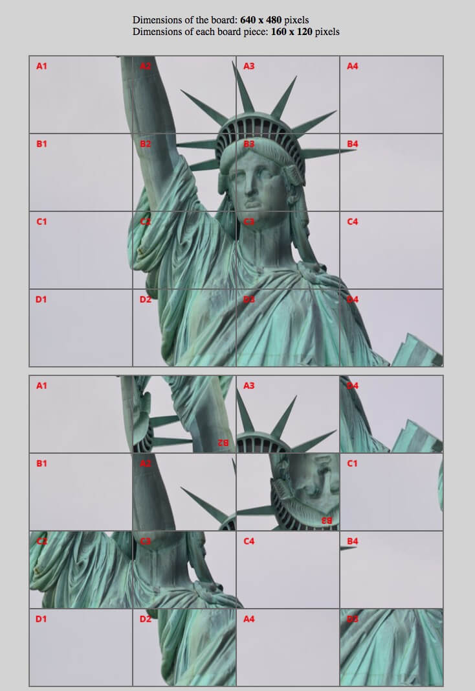

# HTML & CSS | ADVANCED CSS | ANIMATIONS, TRANSITIONS, TRANSFORMS

## Assigment Git Workflow

 - Step one: git pull <remote name>main
 - Step two:Reading the README carefully
 - Step three: Start Coding
 - Step four: git add / git commit / git push
 - step five: Create a pull request to SHA repo choosing your branch


#### INSTRUCTIONS

Try to bring the pieces of the second board back to their original place without touching the HTML code.

You must place your CSS code inside the commented section:

```css
/* SOLUTION: CODE STARTS HERE >> */
/* << SOLUTION: CODE ENDS HERE */
```

Use what you've learned in this lesson and harness the power of CSS transforms to bring order back to this puzzle board.

Once you've finished with the code, push it on a new branch in your GitHub repo, add your instructor(s) as collaborators(s), create a Pull Request and submit the PR's URL.

Good luck!

---

_Photo by Nataraj Munoli from Pexels_# Statue-of-Transforms
